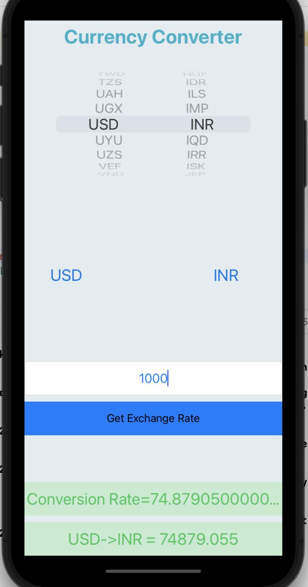

# CurrencyConverterApp
CurrencyConverterApp is an IOS app for converting amount given in one currency to another currency. 

## Features
* User can select the currencies for conversion from Currency Picker.
* User can put amount to be converted in the textbox.
* Integrated REST API call for currency conversion
* When user click ```Convert``` button UI displays the converted curency value as per the currency selected from currency picker.

## Tech Stack and dependencies
* Swift
* ```Alamofire``` for networking call
* ```SwiftyJSON``` for parsing JSON response
* ```SwiftSpinner``` UI component to show while fetching result

## How to run 
* Clone the repo ```https://github.com/dj0894/CurrencyConverterApp.git```
* Navigate to folder  ```CurrencyConverter/```
* Open file ```CurrencyConverter.xcworkspace``` in Xcode and run


## Demo
For full Demo click [here](https://drive.google.com/drive/u/0/folders/1UpGc8nZ2tcgK9rp96cGJKPrXtx1_Mt29)
![DemoGif]

## ScreenShot



 
